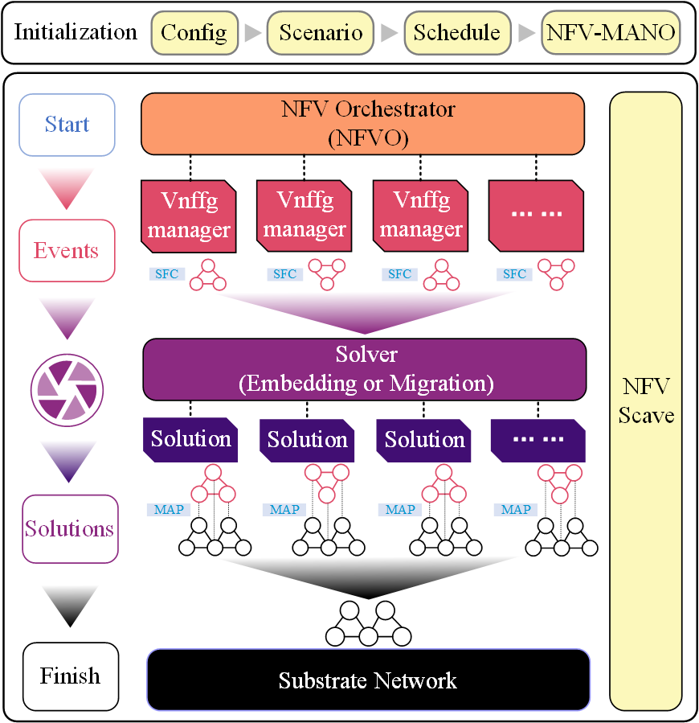
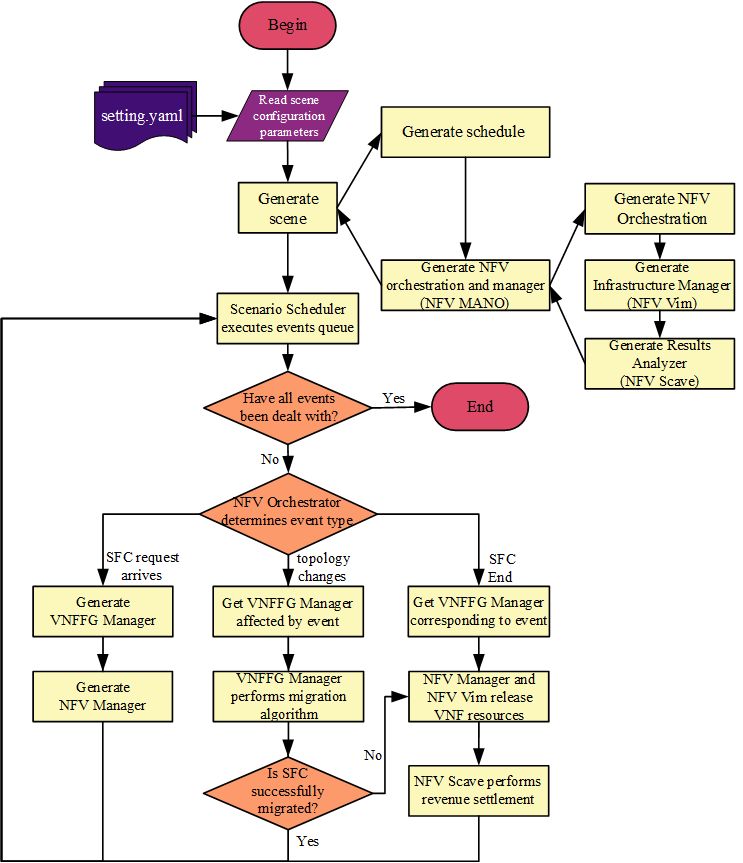
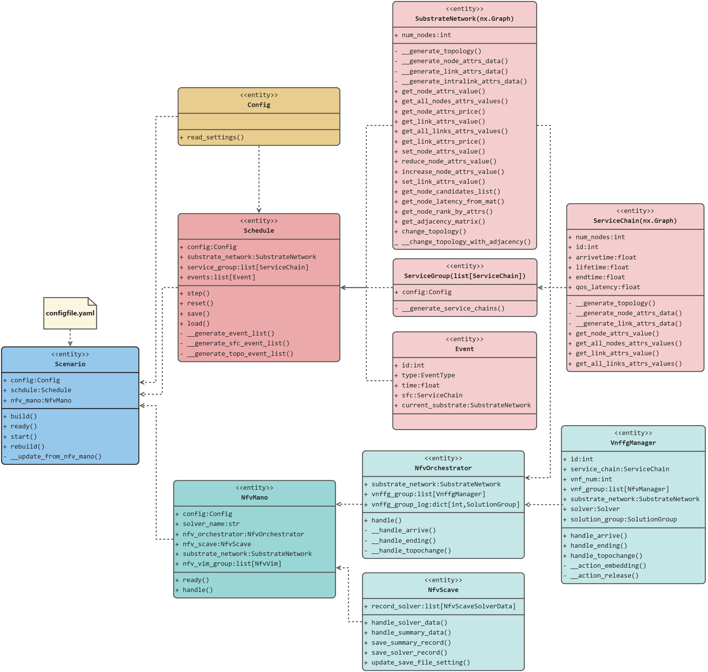
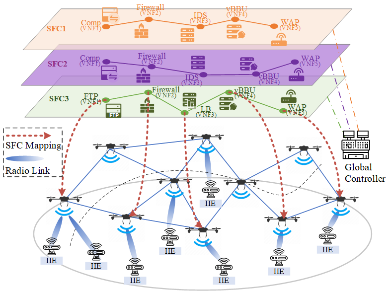

# Mini-SFC: A simulation framework for SFC embedding algorithm with reference to MANO

## Version note

During the development of Mini-SFC, we have modified the simulation framework to different degrees through updated versions. When using the framework, please pay attention to the correspondence between different versions and the functions provided by them (especially the models, metrics, methods used in the paper). If you need past versions, please pay attention to the historical releases provided in the repository

## Citations

If you find Mini-SFC helpful to your research, please feel free to cite our related papers.

**[Drones, 2024] PSO**

Under Version [V1.0]
```bibtex
@Article{drones8040117,
AUTHOR = {Wang, Xi and Shi, Shuo and Wu, Chenyu},
TITLE = {Research on Service Function Chain Embedding and Migration Algorithm for UAV IoT},
JOURNAL = {Drones},
VOLUME = {8},
YEAR = {2024},
NUMBER = {4},
ARTICLE-NUMBER = {117},
URL = {https://www.mdpi.com/2504-446X/8/4/117},
ISSN = {2504-446X},
DOI = {10.3390/drones8040117}
}
```

## Overall Architecture



## Work Flow



## Class Diagram



## Scenario Gallery

### Scenario 1：UAVs and Drones



## Acknowledgments

This framework references the following open source projects, and we would like to express our gratitude to the developers of these projects

[virne](https://github.com/GeminiLight/virne) [github]

[mini-nfv](https://github.com/josecastillolema/mini-nfv) [github]
